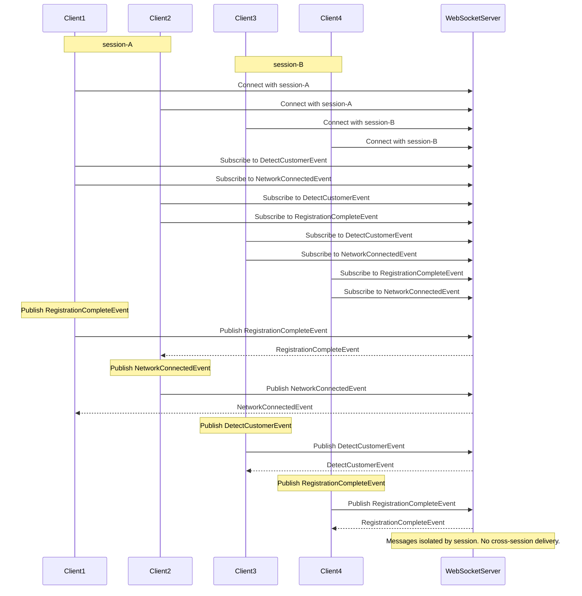

# Test Plan

## Setup

- Connect to a WebSocket server running locally at `ws://127.0.0.1:8081/ws`.
- Define three types of events that clients can listen for:
  - `DetectCustomerEvent`
  - `NetworkConnectedEvent`
  - `RegistrationCompleteEvent`
- Generate a current timestamp to include in messages for consistency and traceability.
- Define two distinct sessions to demonstrate session-based routing:
  - `session_a = "session-A"`
  - `session_b = "session-B"`

## Client Initialization

- Define two logical sessions: `session-A` and `session-B`.
- Clients connect with session:
  - `Client1` and `Client2` connect to `session-A`.
  - `Client3` and `Client4` connect to `session-B`.

## Message Handlers

- Each client registers callback functions to handle specific event types.
- When a message is received for a subscribed event, the client prints a log with its session ID and message content.

## Subscriptions

- Clients subscribe to specific events:
  - `Client1` → `DetectCustomerEvent`, `NetworkConnectedEvent`
  - `Client2` → `DetectCustomerEvent`, `RegistrationCompleteEvent`
  - `Client3` → `DetectCustomerEvent`, `NetworkConnectedEvent`
  - `Client4` → `RegistrationCompleteEvent`, `NetworkConnectedEvent`

## Publishing Messages

- Messages are published to different events, separated by session:
  - In `session-A`:
    - `Client1` publishes a `RegistrationCompleteEvent`
    - `Client2` publishes a `NetworkConnectedEvent`
  - In `session-B`:
    - `Client3` publishes a `DetectCustomerEvent`
    - `Client4` publishes a `RegistrationCompleteEvent`
- Each publish operation includes a timestamp and logs any failure to send.

## Execution Flow Control

- The test introduces brief delays between steps to allow subscriptions and message propagation.
- After publishing, it waits to ensure all messages are processed.

## Expected Behavior

- Messages are only delivered to clients that:
  - Subscribed to the event topic.
  - Belong to the same session as the message publisher.
- No cross-session message delivery should occur.

# Sequence Diagram

